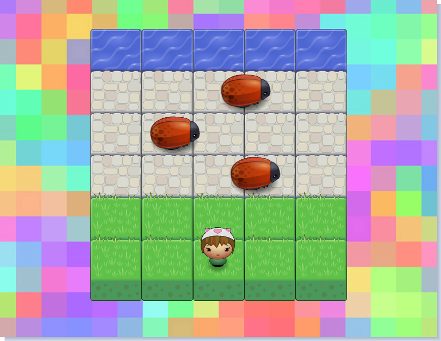

# Classic Arcade Game

You are a tiny creature in desperate need to reach the water.
Cross the road and avoid bugs to win the game!

#### Use your keyboard to play with it [here](https://nyafologus.github.io/arcade%20game/ "Beat the bugs!")!

### Description
>This game is the 4th project for the Udacity [Front-End Web Dev Nanodegree](https://udacity.com/course/front-end-web-developer-nanodegree--nd001/ "Font-End Web Developer Nanodegree"). The goal was to create a classic Arcade Frogger Game using the newly acquired skills in Object Oriented JavaScript (ES6) and HTML5 Canvas. 
Images and a game loop engine were provided. The rest was built in app.js file by Szofi with ♥

## Instructions

#### Installation:

Copy/clone repository from Github using Git:
```sh
$ git clone git@github.com:nyafologus/frontend-nanodegree-arcade-game.git
```
Open ```index.html``` in your browser. 

Alternatively, you can download it from [here](https://github.com/nyafologus/frontend-nanodegree-arcade-game/archive/master.zip "Download ZIP").

#### How to play:

* Use the arrow keys to move your player across the board.
* Avoid collision with the bugs, or you will have to start over.
* Keep going up until you reach the water to win the game.

[](https://nyafologus.github.io/arcade%20game/ "Starting Arcade Game")
